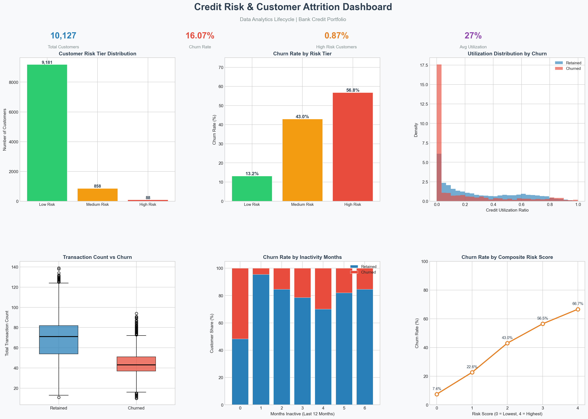

# Credit Utilization & Early Risk Detection Analysis
### A Data Analytics Lifecycle Project | Banking Domain

---

## Overview

This project analyzes customer credit behavior to identify early warning signals of financial stress using credit utilization patterns. It follows the **end-to-end data analytics lifecycle** — from raw data exploration through cleaning, feature engineering, exploratory analysis, risk segmentation, and dashboard reporting.

The goal is to translate raw banking data into actionable risk intelligence that supports proactive credit risk management.

---

## Problem Statement

Credit risk is one of the most critical challenges faced by banking institutions. When borrowers fail to meet repayment obligations, banks face financial losses, increased capital provisioning, and regulatory pressure.

One of the strongest behavioral indicators of financial stress is **credit utilization**:

> **Credit Utilization Ratio = Outstanding Balance ÷ Total Credit Limit**

Elevated or rapidly rising utilization may signal liquidity constraints, over-reliance on revolving credit, or reduced repayment capacity — all of which are early warning signs of potential default or churn.

This project focuses on detecting such patterns early and translating them into business recommendations.

---

## Data Analytics Lifecycle

```
Raw Data → Understanding → Cleaning → Feature Engineering → EDA → Risk Analysis → Dashboard
```

### Phase 1 — Data Understanding `01_data_understanding.ipynb`
- Dataset: [Bank Churners (Kaggle)](https://www.kaggle.com/datasets/sakshigoyal7/credit-card-customers)
- 10,127 customer records | 23 features
- Confirmed zero missing values and no duplicate records
- Classified variables into Demographic, Behavioral, Relational, and Financial Exposure categories
- Identified the target variable: `Attrition_Flag` (16% churn rate)

### Phase 2 — Data Cleaning `02_data_cleaning.ipynb`
- Validated data types across all columns
- Confirmed dataset integrity — no imputation or correction required
- Separated numerical and categorical columns for downstream processing
- Established a clean baseline dataset for feature engineering

### Phase 3 — Feature Engineering `03_feature_engineering.ipynb`
Derived new meaningful features to improve analytical depth:

| Feature | Description |
|---|---|
| `calculated_utilization` | Outstanding balance ÷ credit limit (recalculated cleanly) |
| `High_Utilization_Flag` | 1 if utilization ≥ 80% (financial stress flag) |
| `Low_Utilization_Flag` | 1 if utilization < 10% (disengagement flag) |
| `Credit_Headroom` | Remaining available credit |
| `avg_transaction_value` | Total amount ÷ months on book |
| `Transaction_Intensity` | Spend per individual transaction |
| `Inactive_Customer_Flag` | 1 if inactive months > 3 |
| `High_Contact_Flag` | 1 if service contacts ≥ 4 in 12 months |
| `High_Value_Customer_Flag` | 1 if transaction amount is in top 25% |
| `Churn_Binary` | Target encoded as 1 (churned) / 0 (retained) |

### Phase 4 — Exploratory Data Analysis `04_eda.ipynb`
Key patterns uncovered:

- **Churned customers transact ~35% less frequently** than retained customers
- **High inactivity** (4+ months) strongly correlates with attrition
- **High contact frequency** (4+ contacts/year) signals dissatisfaction
- **Utilization distributions differ** between churned and retained groups — but high utilization alone is not a definitive churn signal
- Correlation heatmap confirmed that behavioral features (transaction count, inactivity) are more strongly associated with churn than demographic features

### Phase 5 — Risk Analysis & Segmentation `05_risk_analysis.ipynb`
Built a composite **Risk Score** (0–4) from four behavioral flags:

| Flag | Condition |
|---|---|
| High Utilization | Utilization ≥ 80% |
| High Contact Frequency | Contacts ≥ 4 in past 12 months |
| Inactivity | Inactive months > 3 |
| Low Transaction Activity | Transaction count in bottom 25% |

Customers are segmented into three risk tiers:

| Risk Tier | Score | Customers | Churn Rate |
|---|---|---|---|
| Low Risk | 0–1 | 9,181 (90.7%) | 13.2% |
| Medium Risk | 2 | 858 (8.5%) | 43.0% |
| High Risk | 3–4 | 88 (0.9%) | 56.8% |

> The risk score clearly separates customers by churn probability — from 13% in low risk to 57% in high risk — validating the behavioral flags as meaningful early warning signals.

### Phase 6 — Dashboard & Reporting `results/dashboard.ipynb`
A 6-panel dashboard was built to communicate findings to business stakeholders:



| Panel | What It Shows |
|---|---|
| Risk Tier Distribution | Volume of customers in each risk category |
| Churn Rate by Risk Tier | How churn rate escalates with risk tier |
| Utilization Distribution | Comparing utilization profiles of churned vs retained |
| Transaction Count vs Churn | Churned customers transact significantly less |
| Churn by Inactivity Months | Longer inactivity linked to higher churn share |
| Risk Score vs Churn Rate | Clear escalation from 7.4% → 66.7% churn |

---

## Key Findings

1. **Transaction frequency is the strongest behavioral churn signal** — customers who churn make significantly fewer transactions in the months prior
2. **Inactivity is a leading indicator** — customers inactive for 4+ months show notably higher churn probability
3. **The composite risk score works** — churn rate rises monotonically from 7.4% (score 0) to 66.7% (score 4), confirming the scoring logic
4. **High utilization alone is not sufficient** — some high-utilization customers remain engaged; the combination of signals matters more than any single metric

---

## Business Recommendations

- **Trigger early outreach** when a customer crosses 80% utilization AND shows declining transaction frequency
- **Prioritize retention campaigns** for customers with Risk Score ≥ 2 (churn rate 43%+)
- **Flag dormant accounts** with 4+ inactive months for re-engagement before they churn
- **Monitor contact frequency** — 4+ service contacts in a year is a dissatisfaction signal, not just a service interaction
- **Segment portfolio monitoring** by risk tier rather than treating all customers uniformly

---

## Project Structure

```
Credit-Risk-Utilization-Analysis/
│
├── Data/
│   ├── BankChurners.csv              # Raw dataset
│   ├── cleaned_bank_data.csv         # Post-cleaning
│   ├── engineered_bank_data.csv      # Post-feature engineering
│   └── risk_segmented_data.csv       # Final scored & segmented dataset
│
├── Notebooks/
│   ├── 01_data_understanding.ipynb
│   ├── 02_data_cleaning.ipynb
│   ├── 03_feature_engineering.ipynb
│   ├── 04_eda.ipynb
│   └── 05_risk_analysis.ipynb
│
├── results/
│   ├── dashboard.ipynb
│   └── professional_credit_dashboard.png
│
├── requirements.txt
└── README.md
```

---

## Tools & Technologies

| Tool | Purpose |
|---|---|
| Python | Core programming language |
| Pandas | Data manipulation and aggregation |
| NumPy | Numerical computations and feature derivation |
| Matplotlib | Dashboard and chart creation |
| Seaborn | Statistical visualizations |
| Jupyter Notebook | Structured, reproducible analysis workflow |

---

## Limitations & Next Steps

This is a practice project built on a publicly available dataset. Acknowledged limitations:

- No time dimension in the dataset — behavioral *trends over time* could not be modeled (e.g., velocity of utilization increase month-over-month)
- The risk score uses equal weighting for all flags — a weighted approach could improve accuracy
- Class imbalance (16% churn) means findings are directional rather than statistically calibrated

**Planned next steps:**
- Add a predictive model (Logistic Regression or Decision Tree) to quantify churn probability per customer
- Explore time-series features if a multi-month dataset becomes available
- Build an interactive dashboard using Plotly or Tableau